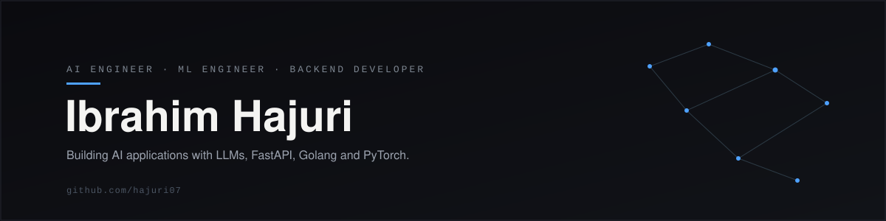

 

<a href="https://linkedin.com/in/ibrahimhajuri">LinkedIn</a> · <a href="https://huggingface.co/hajuri07">Hugging Face</a> · <a href="https://github.com/hajuri07">GitHub</a>

 

### About

Engineering student at JG University, Ahmedabad. I build applications around LLMs and agentic systems, and the backend infrastructure that runs them.

Currently working with **Golang**, **FastAPI**, and **AI agents**. Focused on LLMs, agentic AI, and computer vision, and building toward a career in applied AI.

 

### Stack

 

**AI / ML tooling** — LangChain · LangGraph · CrewAI · Hugging Face · Pinecone · ChromaDB · MLflow · Groq

 

Inference over intuition.

